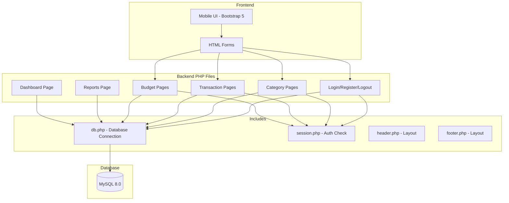
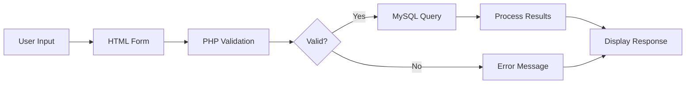
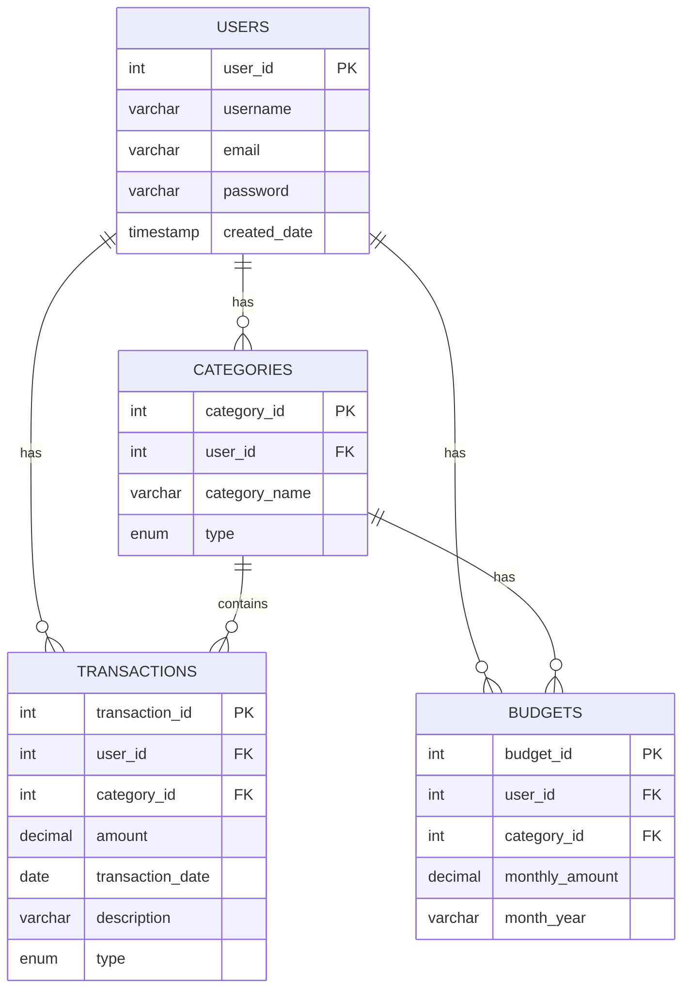

# Design Document

## Overview

BudgetPlanner is a mobile-view, portrait-only Personal Budget Planner system that provides a mobile app-like experience within any browser. The system is built using HTML, CSS, Bootstrap 5, JavaScript, PHP, and MySQL 8.0, following a simple file-based structure typical of student projects.

The application implements full CRUD functionality across four core modules (Users, Categories, Transactions, Budgets) following the workflow: User Input → Validation → MySQL Operation → Processing → Response → Updated Mobile Display.

## Architecture



### System Workflow



## Project Structure

```
BudgetPlanner/
├── index.php              (Login page)
├── register.php           (Registration page)
├── logout.php             (Logout handler)
├── dashboard.php          (Main dashboard)
├── profile.php            (User profile)
├── categories.php         (List categories)
├── add_category.php       (Add category form)
├── edit_category.php      (Edit category form)
├── delete_category.php    (Delete category handler)
├── transactions.php       (List transactions)
├── add_transaction.php    (Add transaction form)
├── edit_transaction.php   (Edit transaction form)
├── delete_transaction.php (Delete transaction handler)
├── budgets.php            (List budgets)
├── add_budget.php         (Add budget form)
├── edit_budget.php        (Edit budget form)
├── delete_budget.php      (Delete budget handler)
├── reports.php            (Reports page)
├── includes/
│   ├── db.php             (Database connection)
│   ├── session.php        (Session/auth check)
│   ├── header.php         (HTML header template)
│   └── footer.php         (HTML footer template)
├── css/
│   └── style.css          (Custom mobile styles)
├── js/
│   └── script.js          (Optional JavaScript)
└── database.sql           (Database schema)
```

## Components

### 1. Database Connection (includes/db.php)
```php
<?php
$host = 'localhost';
$dbname = 'budget_planner';
$username = 'root';
$password = '';

try {
    $pdo = new PDO("mysql:host=$host;dbname=$dbname", $username, $password);
    $pdo->setAttribute(PDO::ATTR_ERRMODE, PDO::ERRMODE_EXCEPTION);
} catch(PDOException $e) {
    die("Connection failed: " . $e->getMessage());
}
?>
```

### 2. Session Check (includes/session.php)
```php
<?php
session_start();
if (!isset($_SESSION['user_id'])) {
    header('Location: index.php');
    exit();
}
?>
```

### 3. Header Template (includes/header.php)
```php
<!DOCTYPE html>
<html lang="en">
<head>
    <meta charset="UTF-8">
    <meta name="viewport" content="width=device-width, initial-scale=1.0, maximum-scale=1.0, user-scalable=no">
    <title>BudgetPlanner</title>
    <link href="https://cdn.jsdelivr.net/npm/bootstrap@5.3.0/dist/css/bootstrap.min.css" rel="stylesheet">
    <link href="css/style.css" rel="stylesheet">
</head>
<body>
<div class="container mobile-container">
```

### 4. Footer Template (includes/footer.php)
```php
</div>
<script src="https://cdn.jsdelivr.net/npm/bootstrap@5.3.0/dist/js/bootstrap.bundle.min.js"></script>
</body>
</html>
```

## Data Models

### Users Table
```sql
CREATE TABLE users (
    user_id INT AUTO_INCREMENT PRIMARY KEY,
    username VARCHAR(50) NOT NULL,
    email VARCHAR(100) NOT NULL UNIQUE,
    password VARCHAR(255) NOT NULL,
    created_date TIMESTAMP DEFAULT CURRENT_TIMESTAMP
);
```

### Categories Table
```sql
CREATE TABLE categories (
    category_id INT AUTO_INCREMENT PRIMARY KEY,
    user_id INT NOT NULL,
    category_name VARCHAR(50) NOT NULL,
    type ENUM('income', 'expense') NOT NULL,
    FOREIGN KEY (user_id) REFERENCES users(user_id) ON DELETE CASCADE
);
```

### Transactions Table
```sql
CREATE TABLE transactions (
    transaction_id INT AUTO_INCREMENT PRIMARY KEY,
    user_id INT NOT NULL,
    category_id INT NOT NULL,
    amount DECIMAL(10, 2) NOT NULL,
    transaction_date DATE NOT NULL,
    description VARCHAR(255),
    type ENUM('income', 'expense') NOT NULL,
    FOREIGN KEY (user_id) REFERENCES users(user_id) ON DELETE CASCADE,
    FOREIGN KEY (category_id) REFERENCES categories(category_id) ON DELETE CASCADE
);
```

### Budgets Table
```sql
CREATE TABLE budgets (
    budget_id INT AUTO_INCREMENT PRIMARY KEY,
    user_id INT NOT NULL,
    category_id INT NOT NULL,
    monthly_amount DECIMAL(10, 2) NOT NULL,
    month_year VARCHAR(7) NOT NULL,
    FOREIGN KEY (user_id) REFERENCES users(user_id) ON DELETE CASCADE,
    FOREIGN KEY (category_id) REFERENCES categories(category_id) ON DELETE CASCADE,
    UNIQUE KEY unique_budget (user_id, category_id, month_year)
);
```

### Entity Relationship Diagram



## Key PHP Operations

### User Registration
```php
// Validate input
$username = trim($_POST['username']);
$email = trim($_POST['email']);
$password = password_hash($_POST['password'], PASSWORD_DEFAULT);

// Check duplicate email
$stmt = $pdo->prepare("SELECT * FROM users WHERE email = ?");
$stmt->execute([$email]);
if ($stmt->rowCount() > 0) {
    $error = "Email already exists";
} else {
    // Insert user
    $stmt = $pdo->prepare("INSERT INTO users (username, email, password) VALUES (?, ?, ?)");
    $stmt->execute([$username, $email, $password]);
}
```

### User Login
```php
$stmt = $pdo->prepare("SELECT * FROM users WHERE email = ?");
$stmt->execute([$email]);
$user = $stmt->fetch(PDO::FETCH_ASSOC);

if ($user && password_verify($password, $user['password'])) {
    $_SESSION['user_id'] = $user['user_id'];
    $_SESSION['username'] = $user['username'];
    header('Location: dashboard.php');
}
```

### Dashboard Calculations
```php
// Total Income
$stmt = $pdo->prepare("SELECT SUM(amount) as total FROM transactions WHERE user_id = ? AND type = 'income'");
$stmt->execute([$_SESSION['user_id']]);
$total_income = $stmt->fetch()['total'] ?? 0;

// Total Expenses
$stmt = $pdo->prepare("SELECT SUM(amount) as total FROM transactions WHERE user_id = ? AND type = 'expense'");
$stmt->execute([$_SESSION['user_id']]);
$total_expenses = $stmt->fetch()['total'] ?? 0;

// Remaining Balance
$remaining = $total_income - $total_expenses;
```

### Budget vs Actual Comparison
```php
$stmt = $pdo->prepare("
    SELECT b.*, c.category_name,
           COALESCE(SUM(t.amount), 0) as spent
    FROM budgets b
    JOIN categories c ON b.category_id = c.category_id
    LEFT JOIN transactions t ON t.category_id = b.category_id 
        AND t.type = 'expense'
        AND DATE_FORMAT(t.transaction_date, '%Y-%m') = b.month_year
    WHERE b.user_id = ?
    GROUP BY b.budget_id
");
$stmt->execute([$_SESSION['user_id']]);
$budgets = $stmt->fetchAll(PDO::FETCH_ASSOC);
```

## Error Handling

### Validation Errors
- Empty required fields → Display "Please fill in all required fields"
- Invalid email format → Display "Please enter a valid email"
- Duplicate email → Display "Email already registered"
- Invalid amount → Display "Please enter a valid amount"
- Zero/negative budget → Display "Amount must be greater than zero"

### Database Errors
- Connection failure → Display "Database connection error"
- Query failure → Display "An error occurred. Please try again."

### Authentication Errors
- Invalid credentials → Display "Invalid email or password"
- Not logged in → Redirect to login page

## Mobile UI Guidelines

### CSS Mobile Container
```css
.mobile-container {
    max-width: 480px;
    margin: 0 auto;
    padding: 15px;
    min-height: 100vh;
}

body {
    background-color: #f5f5f5;
}

.btn {
    padding: 12px 20px;
    font-size: 16px;
}

.card {
    margin-bottom: 15px;
    border-radius: 10px;
}

.form-control {
    padding: 12px;
    font-size: 16px;
}
```

### Navigation
- Use Bootstrap navbar fixed at top or bottom navigation
- Large touch-friendly buttons (minimum 44px height)
- Card-based layouts for data display
- Clear visual feedback for actions

## Testing Strategy

### Manual Testing Checklist
1. User Registration - Create new account with valid data
2. User Login - Login with correct and incorrect credentials
3. Category CRUD - Add, view, edit, delete categories
4. Transaction CRUD - Add, view, edit, delete transactions
5. Budget CRUD - Add, view, edit, delete budgets
6. Dashboard - Verify calculations are correct
7. Reports - Verify category breakdown and filtering
8. Data Isolation - Verify users only see their own data
9. Mobile Layout - Test on different screen sizes
